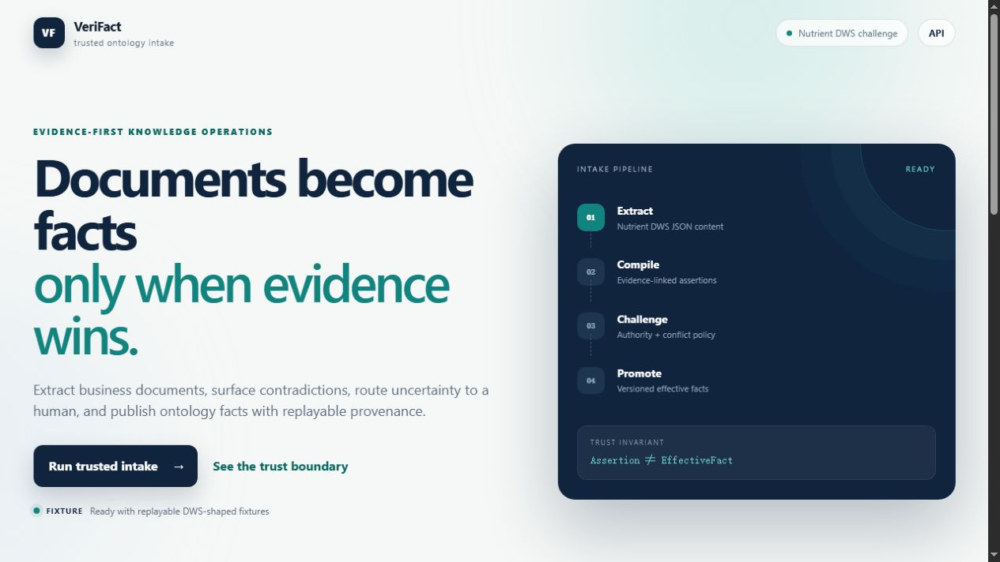
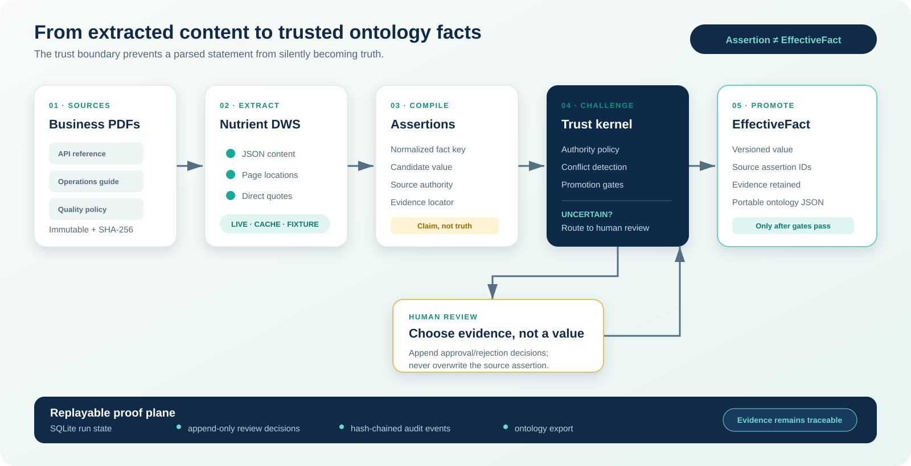
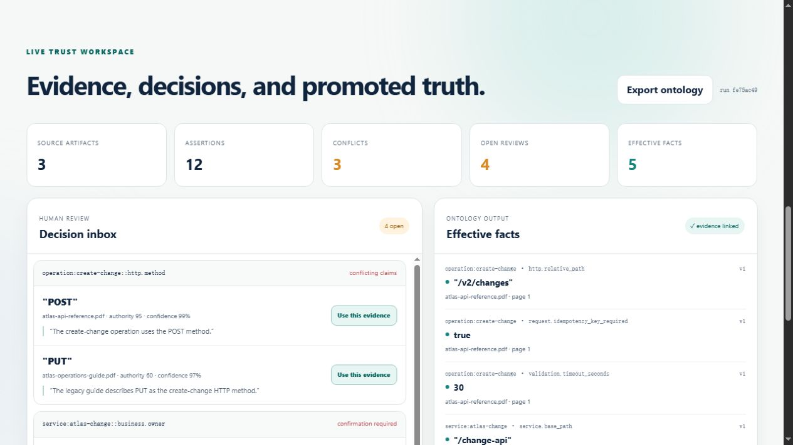
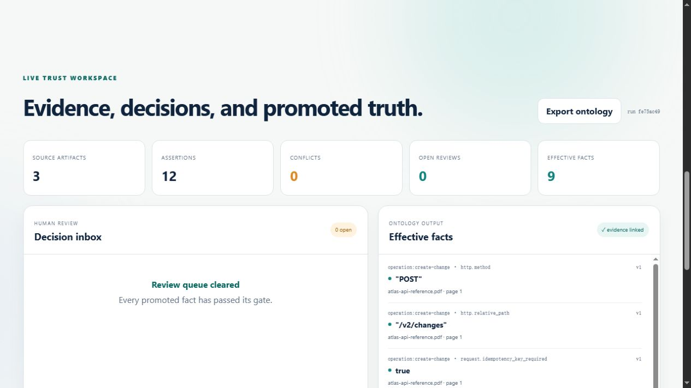
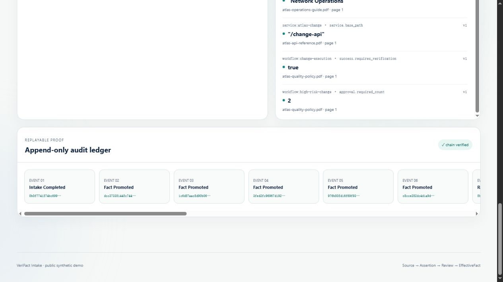

# VeriFact Intake

VeriFact Intake turns messy business documents into evidence-linked ontology
facts. It combines deterministic document extraction, normalized assertions,
conflict detection, human review, and a replayable audit trail.

[](https://github.com/owenshuo/verifact-intake/actions/workflows/ci.yml)
[](LICENSE)

This repository is a new project for the DevNetwork API + Cloud + AI Hackathon
2026, targeting the **Nutrient DWS Challenge**. It is informed by prior work on
quality-operations ontologies, but contains only new, public-safe code and
synthetic data created for this event.



## Judge it in two minutes

With Docker installed:

```bash
git clone https://github.com/owenshuo/verifact-intake.git
cd verifact-intake
docker compose up --build
```

Open <http://localhost:8080>, choose **Run trusted intake**, resolve the four
review items, and export the resulting ontology. No API key is required for the
default replayable fixture run.

**Demo video:** [watch the public 2:40 walkthrough](https://youtu.be/4BP6WnA3pnA).
The [written walkthrough](docs/DEMO.md) and
[recording script](docs/VIDEO_SCRIPT.md) are also available.

## The trust architecture



The central invariant is **Assertion ≠ EffectiveFact**:

```text
Source document
    -> Nutrient DWS extraction
    -> evidence-linked assertions
    -> deterministic validation and conflict detection
    -> automatic acceptance or human review
    -> versioned effective facts
    -> exportable ontology + append-only audit trail
```

An extracted statement is never treated as truth merely because an AI or a
document parser produced it. Every effective fact must retain its source
evidence and promotion history.

## Product walkthrough

| Conflict and review workspace | Resolved ontology facts |
| --- | --- |
|  |  |



## What works now

- Three generated, public-safe PDFs form a reproducible conflict benchmark.
- Fixture and Nutrient DWS extraction share one adapter contract.
- Successful live DWS responses are content-addressed and replayed without another billable call.
- Live requests require an explicit runtime switch and stop at a configured call and credit budget.
- Twelve evidence-linked assertions are assessed by a deterministic trust policy.
- Conflicting and lower-authority claims enter a human review inbox.
- Four review decisions close three conflicts plus one ownership confirmation,
  producing nine evidence-linked effective facts.
- Review decisions are append-only and target immutable assertion fingerprints.
- Effective facts retain their source quote, page, artifact, and assertion IDs.
- A hash-chained audit ledger detects mutation and can be replayed.
- SQLite persists demo runs; the API exports a portable ontology JSON document.
- The browser demo, tests, CI, public-safety scan, and Docker startup are included.

The default mode is a fully replayable fixture run so judges can reproduce the
story without credentials. Nutrient mode reads a validated DWS response cache
first. A cache miss reaches the real API only when `NUTRIENT_LIVE_MODE=true` is
set explicitly.

## Local setup

Prerequisites: Python 3.12+.

```powershell
python -m venv .venv
.venv\Scripts\python -m pip install -e ".[dev]"
.venv\Scripts\python -m pytest
.venv\Scripts\python -m uvicorn verifact_intake.api:app --reload
```

Copy `.env.example` to `.env` for local settings. Secrets belong in `.env` or
`.secrets/`; both are excluded from Git. Never commit a Nutrient or LLM key.

Useful project guides:

- [Demo walkthrough](docs/DEMO.md)
- [Nutrient DWS integration](docs/NUTRIENT_DWS.md)
- [Architecture and trust invariants](docs/ARCHITECTURE.md)
- [Security policy](SECURITY.md)

## License

Apache-2.0.
