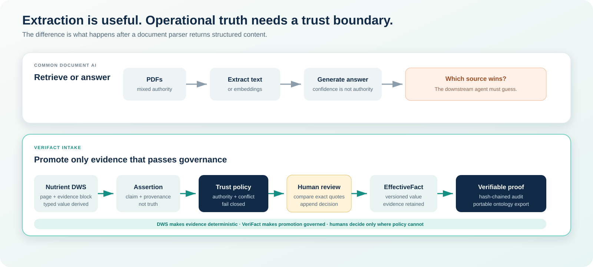
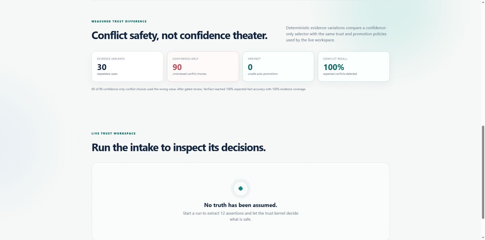
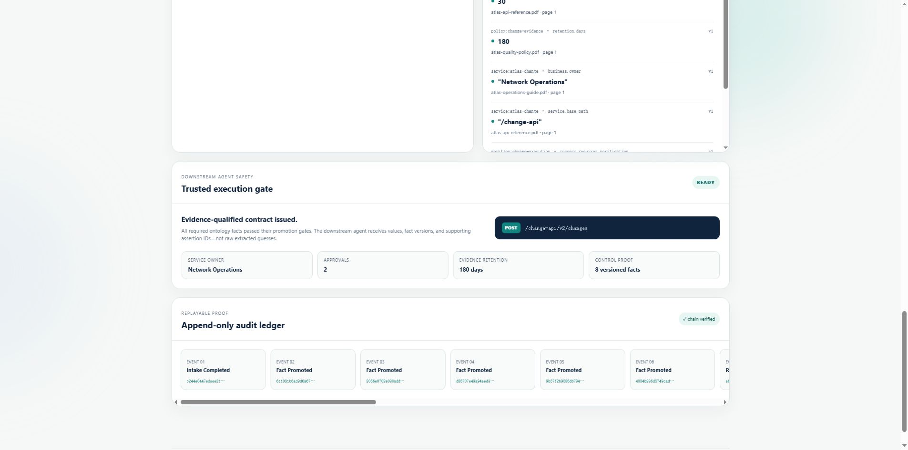

# VeriFact Intake

VeriFact Intake prevents agents and operational systems from silently choosing
between conflicting business documents. It turns API references, operations
guides, and governance policies into evidence-linked ontology facts through
deterministic extraction, conflict detection, human review, and replayable proof.

[](https://github.com/owenshuo/verifact-intake/actions/workflows/ci.yml)
[](LICENSE)

This repository is a new project for the DevNetwork API + Cloud + AI Hackathon
2026, targeting the **Nutrient DWS Challenge**. It is informed by prior work on
quality-operations ontologies, but contains only new, public-safe code and
synthetic data created for this event.


## The operational risk

An API reference says `POST`; an older runbook says `PUT`. A policy requires
two approvals; an operations guide says one. A retention rule says 180 days;
another document says 90. Search and document-chat systems can retrieve both,
but an agent still needs to know which statement is eligible to drive an
operation. VeriFact makes that decision explicit, reviewable, and auditable.

## Judge it in two minutes

With Docker installed:

```bash
git clone https://github.com/owenshuo/verifact-intake.git
cd verifact-intake
docker compose up --build
```

Open <http://localhost:8080>, choose **Run trusted intake**, resolve the four
review items, and export the resulting ontology. No API key is required for the
default replayable fixture run.

The page also shows a checked-in 30-case trust benchmark and a downstream agent
execution gate. Before review, the gate refuses to issue an operation contract.
After all required facts are promoted, it releases an evidence-qualified
`POST /change-api/v2/changes` contract with approval, retention, and verification controls.

**Demo video:** [watch the public 2:40 walkthrough](https://youtu.be/4BP6WnA3pnA).
The [written walkthrough](docs/DEMO.md) and
[recording script](docs/VIDEO_SCRIPT.md) are also available.

## Why Nutrient DWS is core

Nutrient DWS is the only production document adapter. It turns each PDF into
structured evidence blocks before any assertion can exist. The runtime profile
declares the semantic field, extraction pattern, type, and source authority—but
contains no expected value or prewritten quote. The compiler derives both the
typed value and exact evidence quote from DWS output. A missing match fails the
run closed.

The expected values live in a separate golden file used only by tests. Fixture
mode replays extracted blocks through the same compiler; it does not inject
ontology facts.

## The trust architecture




The central invariant is **Assertion ≠ EffectiveFact**:

```text
Source document
    -> Nutrient DWS extraction
    -> evidence-linked assertions
    -> deterministic validation and conflict detection
    -> automatic acceptance or human review
    -> versioned effective facts
    -> exportable ontology + append-only audit trail
```

An extracted statement is never treated as truth merely because an AI or a
document parser produced it. Every effective fact must retain its source
evidence and promotion history.

## Product walkthrough

| Conflict and review workspace | Resolved ontology facts |
| --- | --- |
|  |  |


| Measured trust boundary | Evidence-qualified agent contract |
| --- | --- |
|  |  |

## What works now

- Three generated, public-safe PDFs form a reproducible conflict benchmark.
- Fixture and Nutrient DWS extraction share one adapter contract.
- Successful live DWS responses are content-addressed and replayed without another billable call.
- Live requests require an explicit runtime switch and stop at a configured call and credit budget.
- Twelve typed assertion values are derived from extracted evidence and assessed
  by a deterministic trust policy.
- Conflicting and lower-authority claims enter a human review inbox.
- Four review decisions close three conflicts plus one ownership confirmation,
  producing nine evidence-linked effective facts.
- Review decisions are append-only and target immutable assertion fingerprints.
- Effective facts retain their source quote, page, artifact, and assertion IDs.
- A hash-chained audit ledger detects mutation and can be replayed.
- SQLite persists demo runs; the API exports a portable ontology JSON document.
- The browser demo, tests, CI, public-safety scan, and Docker startup are included.
- The runtime profile contains extraction rules and authority metadata, while a
  separate golden expected-run file acts only as a regression oracle.
- A 30-case deterministic trust benchmark detects 90/90 expected conflicts, records
  zero unsafe auto-promotions, and reaches 100% expected-fact accuracy after review.
- A downstream agent execution gate remains blocked until all eight required ontology
  facts have passed promotion, then returns a versioned evidence-qualified contract.

The default mode is a fully replayable fixture run so judges can reproduce the
story without credentials. Nutrient mode reads a validated DWS response cache
first. A cache miss reaches the real API only when `NUTRIENT_LIVE_MODE=true` is
set explicitly.

## Local setup

Prerequisites: Python 3.12+.

```powershell
python -m venv .venv
.venv\Scripts\python -m pip install -e ".[dev]"
.venv\Scripts\python -m pytest
.venv\Scripts\python -m uvicorn verifact_intake.api:app --reload
```

Copy `.env.example` to `.env` for local settings. Secrets belong in `.env` or
`.secrets/`; both are excluded from Git. Never commit a Nutrient or LLM key.

Useful project guides:

- [Demo walkthrough](docs/DEMO.md)
- [Measured trust benchmark](docs/BENCHMARK.md)
- [Nutrient DWS integration](docs/NUTRIENT_DWS.md)
- [Architecture and trust invariants](docs/ARCHITECTURE.md)
- [Security policy](SECURITY.md)

## License

Apache-2.0.
